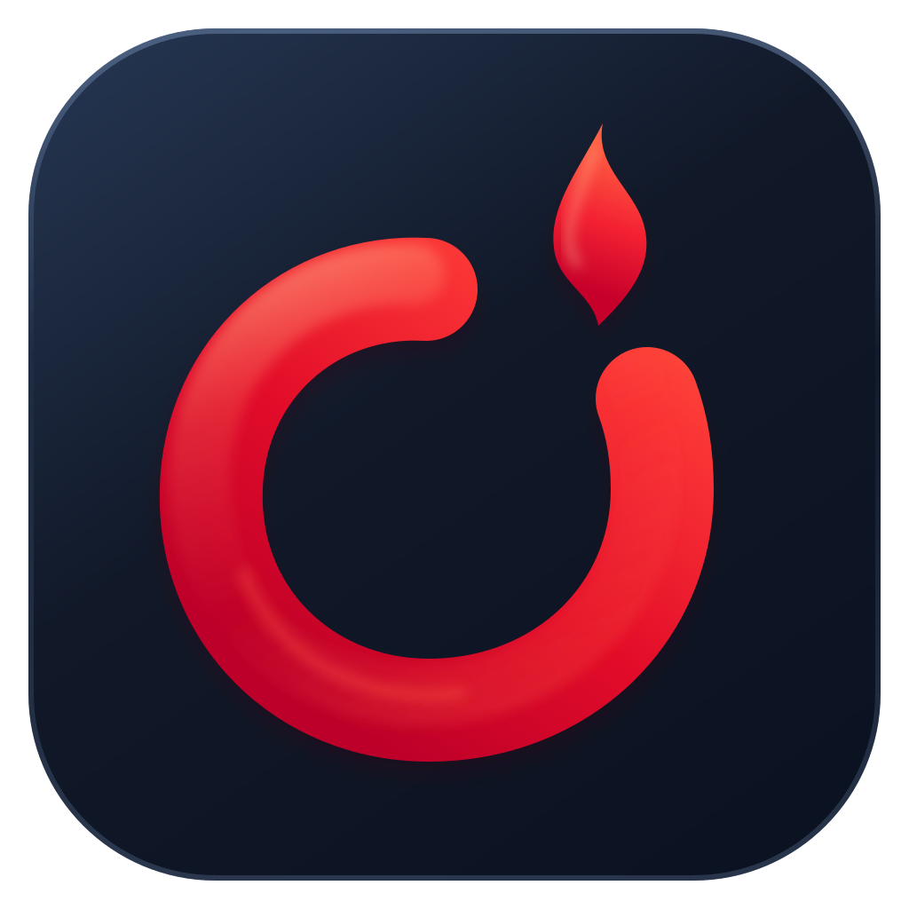
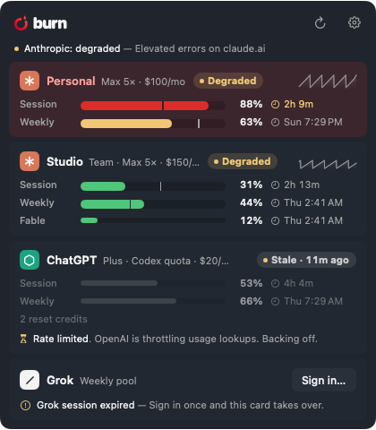
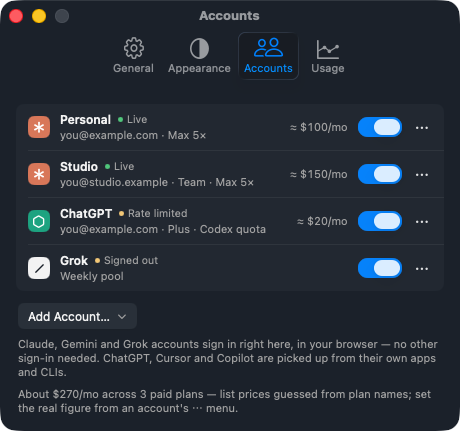
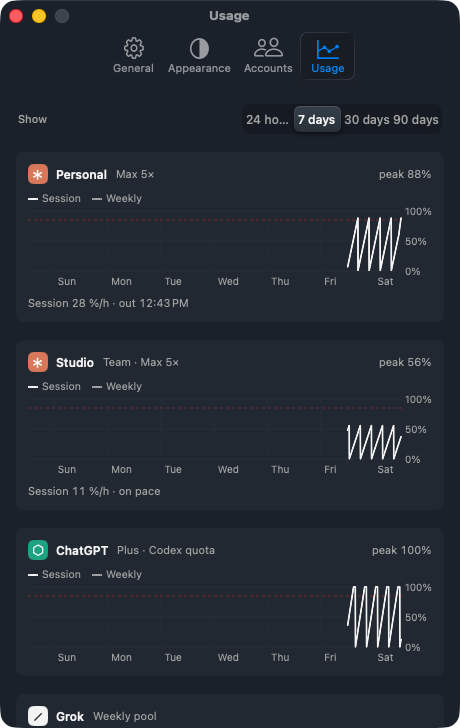

<p align="center">
  
</p>

# Burn

**Burn bright, not out.** A menu-bar app for the Mac that shows how fast you're burning through your AI plans —
every account, every window, how much is left and when it runs out at this pace — and answers the question that
matters at 4 pm: *which account still has room right now?*

Press **⌥Space** and a panel floats over whatever you're doing with one row per account — Claude (business and
personal, as many as you have), ChatGPT via Codex, Grok, Gemini, Cursor, Copilot — a thin bar per window (the 5-hour
session, the week, any model cap that has started to fill) with its percentage, its pace marker and when it resets,
all lined up so accounts compare at a glance, plus a day's sparkline once there is history. A row tints yellow when
its tightest window is getting low and red when it is nearly out. The menu-bar ring tracks whichever account is
closest to its limit; pin any other account beside it.

Each bar carries a **pace marker** — a tick where the window would be if it were used evenly from start to reset —
and Burn works out the recent rate from its own history: hover a reset time for "2.6 %/h, lasts until the reset" or
"at 12 %/h it runs out 9:40 PM, 2 h before it resets". When a window will run out well before its reset, the reset
time turns yellow and, once the window is half used, a notification says so.

The panel is dark by default (Light and Match System are in Settings): a slate ground, flat cards that tint yellow
when a window is getting low and red when it is nearly out. It reads the sign-ins the CLIs and apps already keep on
your Mac (Claude Code's Keychain items, `~/.codex/auth.json`, `~/.grok/auth.json`, Antigravity's token, Cursor's state
database, the GitHub CLI) and can sign accounts in itself. Nothing to paste, nothing sent anywhere except each
vendor's own usage endpoint — and their public status pages.

<p>
  
</p>
<p>
  
  
</p>

## Was Headroom

Burn was called Headroom until 2.0 — a fine word, but three other trackers in this exact niche use it too. The first
launch as Burn moves Headroom's settings, history, sign-ins and launchers across; the only thing to redo is *Launch
at login* (macOS registers it per app), and `burn://` replaces `headroom://` (still accepted).

## Install

Download `Burn.dmg` from the [latest release](https://github.com/tmass1/burn/releases/latest), drag Burn to
Applications, press ⌥Space — or `brew install --cask tmass1/tap/burn`. Signed with a Developer ID and notarized.
Or try it first: [burn-1hx.pages.dev/demo](https://burn-1hx.pages.dev/demo/) is Burn running on a Mac desktop drawn
in the page — the app's own pace, alert and tint rules over a clock at sixty times speed (`site/demo`).

## Build & install

```bash
make install        # release build → signs → /Applications/Burn.app → launches
make run            # debug build, launched from build/
make package        # universal, Developer ID, notarized: build/Burn.dmg and Burn.zip to hand to someone
make release        # the same, published: GitHub release + the Homebrew cask (scripts/release.sh)
```

Requires Xcode (Swift 6). Signing uses the Apple Development identity in the login keychain (set
`BURN_SIGN_IDENTITY` to override, or it falls back to ad-hoc). Packaging and releasing need the Developer ID
certificate and, once, `xcrun notarytool store-credentials burn-notary --apple-id <id> --team-id Y5V8Y3BH9A`.

## Sign-ins

Burn reads the sign-ins the CLIs keep, and can run them for you: Settings → Accounts → **Add Account…** (the
browser opens, you pick the account), or the **Sign in…** button on a card that has lost its session.

- **Claude** — the business account is there already if Claude Code is signed in. Each *added* Claude account gets a
  Claude Code profile of its own (`~/.claude-personal`, then `-2`, …) via `claude auth login`; Burn keeps its
  token fresh. If the browser ends on an authentication code instead of returning, paste it into the field Burn
  shows. To use that profile in a terminal: `CLAUDE_CONFIG_DIR=~/.claude-personal claude`. *Remove Account…* signs
  the profile out and deletes the folder.
- **Grok** — one account, `grok login` under the hood. Burn refreshes the six-hour token itself after that.
- **ChatGPT** — read from the sign-in the ChatGPT app (which bundles Codex) keeps, so sign in there; on a Mac with
  only the `codex` CLI, `codex login`. A second ChatGPT account isn't possible yet.
- **Gemini** — Google retired the Gemini CLI's free tier ("migrate to Antigravity"), so Burn meters Gemini the
  way Antigravity does: *Add Account… → Gemini…* opens Google's account chooser and Burn keeps the sign-in in a
  file of its own (refreshing it with Antigravity's OAuth client, read from the installed app), or the Antigravity
  app's own sign-in is picked up. The card shows Antigravity's Gemini session and weekly pools, plus its pools for
  other models when they start to fill.
- **Cursor** — the Cursor app's sign-in, read from its state database (never written); the plan's included monthly
  usage in dollars, plus on-demand spend.
- **Copilot** — any GitHub sign-in on the Mac (Copilot editor config, `gh`'s hosts file or keychain item); premium
  requests on paid plans, chats and completions on Copilot Free.

The equivalent command is always there to copy, for when a CLI isn't where Burn looks (`/opt/homebrew/bin`,
`/usr/local/bin`, `~/.local/bin`, `~/.claude/local`, `~/.grok/bin`).

## Using it

| Action | How |
|---|---|
| Show / hide the panel | ⌥Space (change it in Settings), or click the menu-bar ring |
| Close | Esc, ⌥Space again, or click anywhere else |
| Refresh now | ↻ in the panel header, or right-click the ring |
| Settings | ⚙ in the panel, or right-click the ring |
| Dark / Light / Match System | Settings → Appearance |
| Add, rename, hide or remove an account | Settings → Accounts (removing never touches the sign-in itself; *Add Account… → Show … again* brings it back) |
| History per account — 24 hours, 7, 30 or 90 days | Settings → Usage (every poll for a week, then one sample an hour) |
| What Claude Code's work would have cost at API prices | Settings → Usage, under each Claude account's chart — read from Claude Code's own session logs, per profile, at Anthropic list prices; Settings → Accounts sums it against what the plans cost. Also in `burn json` as `apiPriced` |
| Pin an account's ring beside the main one | Settings → Appearance → Menu bar → *Also pin*; right-click a pinned ring to unpin |
| Launch at login | Settings, or right-click the ring |

Colors mean one thing — how close a window is to running out: green under 60 %, yellow to 85 %, red above — always
next to the number, never alone.

## Vendor status and launchers

The vendors' own status pages (status.claude.com, status.openai.com, status.cursor.com, githubstatus.com) are checked
every five minutes. An incident on a component Burn depends on shows as a **Degraded** or **Outage** chip on the
rows it affects and a line under the panel title; a provider that fails during one gets a card saying so, with a
link to the page, instead of a sign-in prompt. Settings → General turns it off.

Every Claude account can have a command of its own — `claude-atlas`, `claude-studio` — a two-line shim in
`~/.local/bin` that runs Claude Code signed in as that account (its `CLAUDE_CONFIG_DIR` profile), so switching is a
different command rather than a different login. Install them from Settings → Accounts (the ⋯ menu, or *Install all
commands*) or with `burn launchers install`. Hover a row in the panel for **Open Terminal with this account**
(Terminal or iTerm2 get a `.command` file; other terminals get the command on the clipboard — Settings → General
picks which), **Copy Command**, or the vendor's app for the other providers.

## Command line

`make install` (or Settings → General → Command line) puts `burn` in `~/.local/bin` — a wrapper that runs the
app's binary in CLI mode, reading what the app last wrote rather than fetching anything itself:

```bash
burn                     # one line per account: windows, used %, resets, "runs out …" when a window is going fast
burn status atlas    # one line for an account (no name: the account the menu bar shows)
burn json            # everything, including pace, for scripts
burn refresh         # ask the running app to refresh now; `burn open` shows the panel
burn launchers       # the claude-<account> commands, and `launchers install [account]` / `remove <account>`
```

`burn statusline` prints a segment for the Claude Code status line — `◐ Studio · 3% · 4h 49m · wk 16%` — for the
Claude account whose profile the session runs as (`CLAUDE_CONFIG_DIR`), else the default profile, and nothing at all
when there is no match. `burn statusline --install` (or the Settings button) adds it after whatever status line
is already configured: it writes `~/.claude/statusline-burn.sh`, which runs the existing command and appends the
segment, backs up `~/.claude/settings.json`, and points `statusLine` at the wrapper. `--dry-run` shows the plan.

## URL scheme (Shortcuts, scripts)

`burn://toggle` · `burn://show` · `burn://hide` · `burn://refresh` · `burn://settings[?tab=general|appearance|accounts]`

Burn notifies when a window passes 85 % (the threshold, reset alerts and quiet hours are under Settings →
General), when one that was getting low resets, when one will run out before it resets at its current pace, and
when usage is unusually high for you: a window burning at 3× its typical busy hour (measured from your own week
of samples), or a model — or a Claude account — doing 3× a typical day's API-priced work, from Claude Code's logs.
The multiple is yours to set (2×, 3×, 5×); the card wears a "3× usual" chip and `burn` marks the window meanwhile.
Design review helpers: `burn://alerts?test=1` (four sample notifications), `burn://demo` (fixture accounts in every state), `burn://live` (back to real data),
`burn://appearance?mode=dark|light|system`, `burn://capture?path=/tmp/panel.png[&target=menubar|settings]`.

## Where things live

- `Sources/Burn/Providers/` — one file per service. Adding a provider = a new `ProviderID` case and one file
  that turns local credentials into `AccountSnapshot`s.
- `Sources/Burn/Store/` — polling, backoff, history samples, preferences.
- `Sources/Burn/UI/` — the panel, cards, gauges, settings.
- `~/Library/Application Support/Burn/` — last snapshots and paces (what the CLI reads), 90 days of history (dense for a week, hourly after), `spend.json` (tokens per day and model from Claude Code's logs, with each log's read offset), `burn.log`.

## Endpoints (internal, undocumented — each provider is isolated so one breaking only greys out its card)

- Claude: `GET api.anthropic.com/api/oauth/usage` + `/profile`, refresh via `platform.claude.com/v1/oauth/token`
- ChatGPT: `GET chatgpt.com/backend-api/wham/usage` (the Codex quota — ChatGPT's chat message caps aren't exposed)
- Grok: `GET cli-chat-proxy.grok.com/v1/billing?format=credits` + `/v1/settings`, refresh via `auth.x.ai/oauth2/token`
- Gemini: `POST cloudcode-pa.googleapis.com/v1internal:retrieveUserQuotaSummary` (+ `:loadCodeAssist` for the plan) as
  Antigravity, refresh via `oauth2.googleapis.com/token` with Antigravity's client
- Cursor: `POST api2.cursor.sh/aiserver.v1.DashboardService/GetCurrentPeriodUsage` + `GetPlanInfo` (Connect RPC),
  renewal via `api2.cursor.sh/oauth/token` kept in memory
- Copilot: `GET api.github.com/copilot_internal/user` with the token the Copilot clients send
