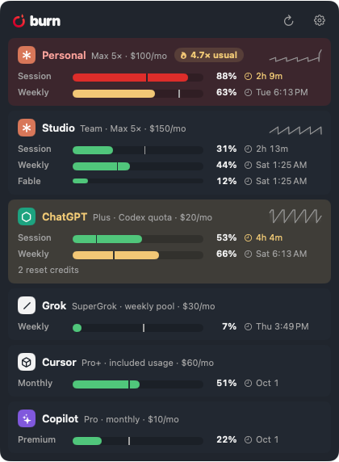

# 5 · Unusual usage

**In one line:** a banner when usage is unusually high *for you* — a window burning at several times this account's
typical busy hour, or a model (or a Claude account) doing several times a typical day's API-priced work — before it
is a threshold or run-out problem.

**Status: built 14 September 2026.** "Unusual" is a multiple of your own history (2×, 3× or 5×, Settings → General;
3× by default), never a number to tune per account. `Baseline.swift` derives the norms from what Burn already keeps:
the dense week of samples behind the sparkline (the 75th percentile of active hours — what a busy hour usually looks
like, so light hours don't drag the norm down — gaps and resets skipped, the pace lookback left out so a surge can't
set its own bar) and `APISpend`'s per-day, per-model token totals (the same percentile of active days, today left out). `Pace` carries `typical` and `multiple`; `APISpend.surges` lists today's outliers per model and per
account. Floors keep a multiple of nothing quiet: 10 %/h for sessions, 1.5 %/h weekly, 0.5 %/h monthly; $20 a day
for a model, $40 for an account.

**Where it shows:** a "3× usual" chip on the card (tooltip names the window or model), "· 3× usual" in the Usage
tab's pace line and in `burn`, "$310 today · 4× typical" on the spend line, and two banners — one per window per
reset period ("Personal session is burning 3× your usual · 28 %/h now · 9 %/h is typical"), one per model per day
("Opus 5 on Personal: $310 of API work today · 4× a typical day ($75) · 27M tokens"); the account total speaks only
when no single model already did.

**Known limits:** the model side reads Claude Code's session logs, so the desktop app's work is invisible to it (the
window side still sees it); a new account has no norm for its first two days of use.

